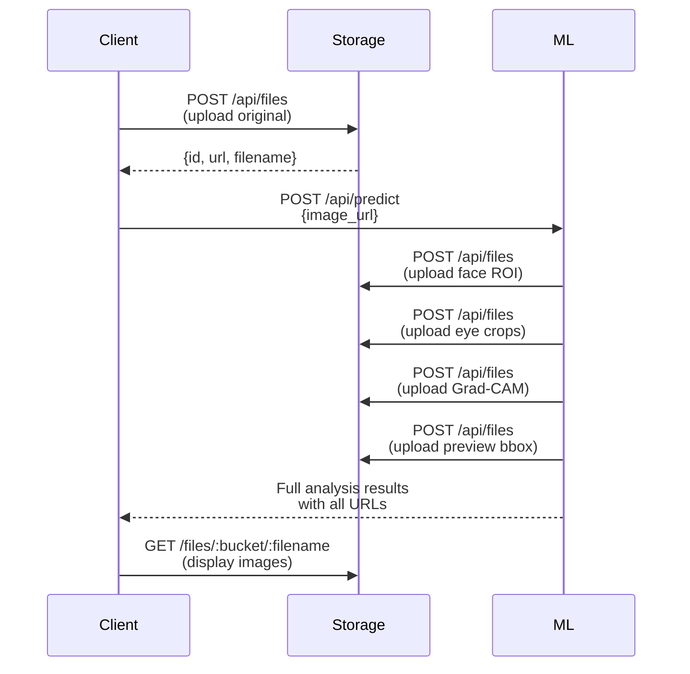

# API Reference Overview

Selamat datang di API Reference ResCAT! Dokumentasi ini menyediakan informasi lengkap tentang semua endpoint API yang tersedia dalam ekosistem ResCAT.

## 📡 Available APIs

### 1. ML Service API
**Base URL**: `https://ml.rescat.life`

Machine Learning service untuk deteksi dan klasifikasi kesehatan kucing.

**Key Features**:
- ✅ Cat image validation
- ✅ Face detection with YOLO
- ✅ Landmark detection
- ✅ Multi-area classification
- ✅ Grad-CAM visualization

[📚 View ML Service API Reference →](/docs/api/ml-service)

---

### 2. Storage Service API
**Base URL**: `https://storage.rescat.life`

File storage service untuk manajemen gambar dan file.

**Key Features**:
- ✅ File upload with bucket organization
- ✅ List, get, and delete operations
- ✅ Static file serving with caching
- ✅ Rate limiting protection
- ✅ RESTful API design

[📚 View Storage Service API Reference →](/docs/api/storage-service)

---

## 🔑 Authentication

### Current Status
**Public API** - No authentication required (saat ini)

> ⚠️ **Note untuk Production**: Disarankan untuk mengimplementasikan authentication (API Key atau OAuth) untuk production environment.

### Planned Authentication (Future)
```http
Authorization: Bearer {api_key}
```

---

## 🌐 Base URLs

| Service | Environment | Base URL |
|---------|-------------|----------|
| ML Service | Production | `https://ml.rescat.life` |
| ML Service | Development | `http://localhost:5000` |
| Storage Service | Production | `https://storage.rescat.life` |
| Storage Service | Development | `http://localhost:8080` |

---

## 📊 Response Format

Semua API menggunakan JSON response format yang konsisten.

### Success Response
```json
{
  "ok": true,
  "data": {
    // Response data
  }
}
```

### Error Response
```json
{
  "ok": false,
  "error": "ERROR_CODE",
  "message": "Human-readable error message",
  "hint": "Optional hint for solving the error"
}
```

---

## 🚦 Rate Limiting

### Storage Service
```
Endpoint: POST /api/files
Limit: 30 requests per minute
```

**Headers**:
```http
RateLimit-Limit: 30
RateLimit-Remaining: 25
RateLimit-Reset: 1765075450000
```

### ML Service
No rate limiting implemented (currently)

> **Recommendation**: Implement rate limiting for production

---

## ⚠️ Error Codes

### Common HTTP Status Codes

| Status | Meaning | Usage |
|--------|---------|-------|
| `200 OK` | Success | Successful request |
| `400 Bad Request` | Client error | Invalid input, validation errors |
| `404 Not Found` | Resource not found | File/resource doesn't exist |
| `413 Payload Too Large` | File too large | Exceeds MAX_FILE_MB limit |
| `429 Too Many Requests` | Rate limited | Too many requests |
| `500 Internal Server Error` | Server error | Unexpected error |

### Application Error Codes

#### Storage Service
| Error Code | Description |
|------------|-------------|
| `EXT_NOT_ALLOWED` | Invalid file extension |
| `BUCKET_NOT_ALLOWED` | Invalid bucket name |
| `NO_FILE` | No file in upload request |
| `BAD_NAME` | Invalid filename format |
| `FILE_TOO_LARGE` | File size exceeds limit |
| `NOT_FOUND` | Resource not found |
| `CONFIRM_REQUIRED` | Missing confirmation parameter |

#### ML Service
| Error Code | Description |
|------------|-------------|
| `NOT_A_CAT` | Image validation failed |
| `NO_FACE_DETECTED` | Could not detect cat face |
| `LANDMARK_DETECTION_FAILED` | Failed to detect landmarks |
| `CLASSIFICATION_ERROR` | Classification failed |
| `INVALID_IMAGE_URL` | Invalid or inaccessible URL |
| `MODEL_LOAD_ERROR` | Failed to load ML model |

---

## 🔄 Typical Integration Flow

### Complete Scan Flow



### Example Implementation

**Step 1: Upload Original Image**
```javascript
const formData = new FormData();
formData.append('file', catImage);
formData.append('bucket', 'original-photo');

const uploadRes = await fetch('https://storage.rescat.life/api/files', {
  method: 'POST',
  body: formData
});

const uploadData = await uploadRes.json();
const imageUrl = uploadData.data.url;
```

**Step 2: Request ML Analysis**
```javascript
const mlRes = await fetch('https://ml.rescat.life/api/predict', {
  method: 'POST',
  headers: { 'Content-Type': 'application/json' },
  body: JSON.stringify({ 
    image_url: imageUrl,
    remove_bg: true,
    generate_gradcam: true
  })
});

const analysis = await mlRes.json();
```

**Step 3: Display Results**
```javascript
// Show original and preview
document.getElementById('original').src = analysis.original_url;
document.getElementById('preview').src = analysis.preview_url;

// Show area analysis
Object.entries(analysis.classifications).forEach(([area, result]) => {
  console.log(`${area}: ${result.class} (${result.confidence})`);
  
  // Display crop and Grad-CAM
  displayAreaResult(area, result.crop_url, result.gradcam_url);
});
```

---

## 📝 Code Examples

### cURL Examples

**Upload to Storage**:
```bash
curl -X POST https://storage.rescat.life/api/files \
  -F "file=@cat.jpg" \
  -F "bucket=original-photo"
```

**ML Prediction**:
```bash
curl -X POST https://ml.rescat.life/api/predict \
  -H "Content-Type: application/json" \
  -d '{"image_url": "https://storage.rescat.life/files/original-photo/..."}'
```

### JavaScript/Fetch

```javascript
// Complete workflow
async function analyzeCat(imageFile) {
  try {
    // 1. Upload
    const formData = new FormData();
    formData.append('file', imageFile);
    formData.append('bucket', 'original-photo');
    
    const uploadRes = await fetch('https://storage.rescat.life/api/files', {
      method: 'POST',
      body: formData
    });
    const { data: uploadData } = await uploadRes.json();
    
    // 2. Analyze
    const mlRes = await fetch('https://ml.rescat.life/api/predict', {
      method: 'POST',
      headers: { 'Content-Type': 'application/json' },
      body: JSON.stringify({ image_url: uploadData.url })
    });
    const analysis = await mlRes.json();
    
    return analysis;
  } catch (error) {
    console.error('Analysis failed:', error);
    throw error;
  }
}
```

### Python

```python
import requests

def analyze_cat(image_path):
    """Complete cat analysis workflow"""
    
    # 1. Upload to storage
    with open(image_path, 'rb') as f:
        files = {'file': f}
        data = {'bucket': 'original-photo'}
        
        upload_res = requests.post(
            'https://storage.rescat.life/api/files',
            files=files,
            data=data
        )
        image_url = upload_res.json()['data']['url']
    
    # 2. Request ML analysis
    ml_res = requests.post(
        'https://ml.rescat.life/api/predict',
        json={'image_url': image_url}
    )
    
    return ml_res.json()

# Usage
result = analyze_cat('my_cat.jpg')
print(f"Health Score: {result['health_score']}")
```

### PHP (Laravel)

```php
use GuzzleHttp\Client;

class CatAnalysisService
{
    protected $storage;
    protected $ml;
    
    public function __construct()
    {
        $this->storage = new Client(['base_uri' => 'https://storage.rescat.life']);
        $this->ml = new Client(['base_uri' => 'https://ml.rescat.life']);
    }
    
    public function analyze($imagePath)
    {
        // 1. Upload
        $uploadRes = $this->storage->post('/api/files', [
            'multipart' => [
                ['name' => 'file', 'contents' => fopen($imagePath, 'r')],
                ['name' => 'bucket', 'contents' => 'original-photo']
            ]
        ]);
        
        $imageUrl = json_decode($uploadRes->getBody())->data->url;
        
        // 2. Analyze
        $mlRes = $this->ml->post('/api/predict', [
            'json' => ['image_url' => $imageUrl]
        ]);
        
        return json_decode($mlRes->getBody(), true);
    }
}
```

---

## 🧪 Testing & Development

### Test Endpoints

**Health Checks**:
```bash
# ML Service
curl https://ml.rescat.life/health

# Storage Service (check if server responds)
curl https://storage.rescat.life/api/files
```

### Postman Collection

Download Postman collection untuk testing:
- [Storage Service Collection](#)
- [ML Service Collection](#)

---

## 📞 Support

### API Issues
- **Storage Service**: [GitHub Issues](https://github.com/bayufadayan/rescat-storage/issues)
- **ML Service**: Contact ML team

### Documentation
- **Report errors**: docs@rescat.life
- **Suggest improvements**: Create issue on GitHub

---

## 🔄 Changelog

### Version 1.0.0 (Current)
- ✅ Storage Service API v1
- ✅ ML Service API v1
- ✅ Basic file operations
- ✅ Full prediction pipeline
- ✅ Grad-CAM visualization

### Planned (Future)
- 🔜 API Authentication (API Keys)
- 🔜 Webhook notifications
- 🔜 Batch processing
- 🔜 Async processing with job queue
- 🔜 GraphQL API option

---

## 📚 Next Steps

Ready to integrate? Check out the detailed API references:

- [ML Service API Reference →](/docs/api/ml-service)
- [Storage Service API Reference →](/docs/api/storage-service)
- [Main App Documentation →](/docs/services/main-app)
