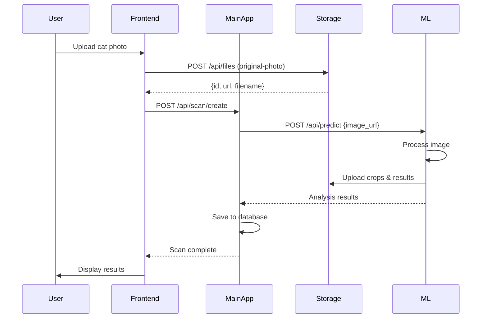

# Main Application Service

**URL**: [app.rescat.life](https://app.rescat.life)

Main Application adalah aplikasi web berbasis Laravel + Inertia.js yang menjadi interface utama untuk end users. Aplikasi ini mengelola user interaction, cat profiles, scan history, dan integrasi dengan ML & Storage services.

## 🎯 Overview

### Purpose
- User-facing application untuk deteksi kesehatan kucing
- Dashboard untuk melihat riwayat scan
- Manajemen profil kucing
- Pet care finder
- Educational articles

### Technology Stack
- **Backend Framework**: Laravel 11 (PHP 8.2+)
- **Frontend**: Inertia.js + React/Vue.js
- **Database**: MySQL/PostgreSQL
- **Authentication**: Laravel Fortify + Google OAuth
- **Admin Panel**: Filament
- **API Integration**: Guzzle HTTP Client

---

## 🏗️ Fitur Utama

### 1. Authentication & User Management

#### Multi-Provider Auth
```php
// Supported providers
- Email/Password (Laravel Fortify)
- Google OAuth 2.0
- Role-based access (Admin, User)
```

#### User Registration Flow
```
1. User accesses /register
2. Fill form OR click "Sign in with Google"
3. Email verification (optional)
4. Redirect to dashboard
```

#### Google OAuth Flow
```php
// Routes
Route::get('/auth/google', [GoogleController::class, 'redirect']);
Route::get('/auth/google/callback', [GoogleController::class, 'callback']);

// Stores in users table:
- google_id
- google_token
- google_refresh_token
```

---

### 2. Cat Profile Management

#### Data Model
```php
Schema::create('cats', function (Blueprint $table) {
    $table->id();
    $table->foreignId('user_id')->constrained()->cascadeOnDelete();
    $table->string('name');
    $table->string('breed')->nullable();
    $table->enum('gender', ['male', 'female', 'unknown'])->default('unknown');
    $table->date('birth_date')->nullable();
    $table->string('avatar')->nullable();
    $table->timestamps();
    $table->softDeletes();
});
```

#### Features
- ✅ Create, Read, Update, Delete cat profiles
- ✅ Upload avatar image
- ✅ Multiple cats per user
- ✅ Track health history per cat
- ✅ Calculate age automatically from birth_date

#### Example Usage
```php
// Create new cat
$cat = auth()->user()->cats()->create([
    'name' => 'Fluffy',
    'breed' => 'Persian',
    'gender' => 'female',
    'birth_date' => '2022-05-15',
    'avatar' => 'cats/fluffy-avatar.jpg'
]);

// Get all user's cats
$cats = auth()->user()->cats()->get();

// Get cat with scan history
$cat = Cat::with('scans')->find($id);
```

---

### 3. Scan & Detection

#### Scan Flow



#### Scan Data Model
```php
Schema::create('scans', function (Blueprint $table) {
    $table->id();
    $table->foreignId('cat_id')->constrained()->cascadeOnDelete();
    $table->foreignId('user_id')->constrained()->cascadeOnDelete();
    
    // Status tracking
    $table->enum('status', ['pending', 'processing', 'completed', 'failed'])
          ->default('pending');
    
    // Image URLs
    $table->string('original_image_url');
    $table->string('face_roi_url')->nullable();
    $table->string('preview_bbox_url')->nullable();
    
    // ML Results (JSON)
    $table->json('detection_results')->nullable();
    $table->json('classification_results')->nullable();
    
    // Landmarks
    $table->json('landmarks')->nullable();
    
    // Overall score
    $table->decimal('confidence_score', 5, 2)->nullable();
    $table->decimal('health_score', 5, 2)->nullable();
    
    // Error tracking
    $table->text('error_message')->nullable();
    
    $table->timestamps();
    $table->softDeletes();
});
```

#### API Endpoints (Internal)

**Create Scan**
```php
POST /api/scan/create
Content-Type: application/json
Authorization: Bearer {token}

Request:
{
  "cat_id": 1,
  "image_url": "https://storage.rescat.life/files/original-photo/..."
}

Response:
{
  "success": true,
  "scan_id": 123,
  "status": "processing"
}
```

**Get Scan Result**
```php
GET /api/scan/{id}
Authorization: Bearer {token}

Response:
{
  "id": 123,
  "cat_id": 1,
  "status": "completed",
  "original_image_url": "...",
  "face_roi_url": "...",
  "preview_bbox_url": "...",
  "health_score": 87.5,
  "classification_results": {
    "left_eye": {
      "class": "normal",
      "confidence": 0.92,
      "crop_url": "...",
      "gradcam_url": "..."
    },
    "right_eye": {
      "class": "abnormal",
      "confidence": 0.78,
      "crop_url": "...",
      "gradcam_url": "..."
    },
    // ... other areas
  },
  "created_at": "2025-01-15T10:30:00Z"
}
```

---

### 4. Pet Care Finder

#### Purpose
Help users find nearest veterinary clinics and pet care facilities.

#### Data Model
```php
Schema::create('pet_cares', function (Blueprint $table) {
    $table->id();
    $table->string('name');
    $table->text('address');
    $table->string('phone')->nullable();
    $table->string('email')->nullable();
    $table->string('website')->nullable();
    
    // Geolocation
    $table->decimal('latitude', 10, 8);
    $table->decimal('longitude', 11, 8);
    
    // Operating hours
    $table->json('working_hours')->nullable();
    
    // Services
    $table->json('services')->nullable(); // ['vaccination', 'surgery', etc]
    
    // Rating
    $table->decimal('rating', 3, 2)->default(0);
    $table->integer('review_count')->default(0);
    
    $table->timestamps();
});
```

#### Features
- 📍 GPS-based nearest location search
- 🗺️ Map integration (Google Maps/Leaflet)
- 📞 Click-to-call functionality
- ⭐ Rating and reviews
- 🕐 Working hours display
- 🔍 Filter by services (vaccination, grooming, etc)

#### API Example
```php
GET /api/pet-cares/nearby
Parameters:
  - lat: User's latitude
  - lng: User's longitude
  - radius: Search radius in km (default: 10)
  - services: Array of required services

Response:
{
  "data": [
    {
      "id": 1,
      "name": "Happy Paws Clinic",
      "address": "Jl. Example No. 123",
      "distance": 2.5, // km
      "latitude": -6.200000,
      "longitude": 106.816666,
      "rating": 4.5,
      "services": ["vaccination", "surgery", "grooming"]
    }
  ]
}
```

---

### 5. Article Management

#### Purpose
Educational content about cat health, care tips, and disease information.

#### Data Model
```php
Schema::create('articles', function (Blueprint $table) {
    $table->id();
    $table->string('title');
    $table->string('slug')->unique();
    $table->text('excerpt')->nullable();
    $table->longText('content');
    $table->string('featured_image')->nullable();
    
    // Author
    $table->foreignId('author_id')->constrained('users');
    
    // Categories & Tags
    $table->json('categories')->nullable();
    $table->json('tags')->nullable();
    
    // SEO
    $table->string('meta_title')->nullable();
    $table->text('meta_description')->nullable();
    
    // Publishing
    $table->enum('status', ['draft', 'published', 'archived'])->default('draft');
    $table->timestamp('published_at')->nullable();
    
    // Analytics
    $table->integer('view_count')->default(0);
    
    $table->timestamps();
    $table->softDeletes();
});
```

#### Features
- ✍️ Rich text editor (TinyMCE/Quill)
- 📸 Image upload and gallery
- 🏷️ Categories and tags
- 📅 Schedule publishing
- 🔍 SEO optimization
- 📊 View tracking
- 💬 Comments (optional)

---

### 6. Admin Panel (Filament)

#### Features
- 📊 Dashboard with statistics
- 👥 User management
- 🐱 Cat profiles moderation
- 📋 Scan history monitoring
- 📍 Pet care management
- 📝 Article CMS
- ⚙️ System settings
- 📈 Analytics and reports

#### Dashboard Widgets
```php
// Key metrics
- Total Users
- Total Scans (Today/Week/Month)
- Success Rate
- Average Health Score
- Active Cats
- Popular Breeds
```

#### Access
```
URL: /admin
Requires: Admin role
```

---

## 🔌 External API Integration

### Integration with Storage Service

```php
use GuzzleHttp\Client;

class StorageService
{
    protected $client;
    protected $baseUrl = 'https://storage.rescat.life';
    
    public function uploadFile($file, $bucket = 'original-photo')
    {
        $response = $this->client->post('/api/files', [
            'multipart' => [
                ['name' => 'file', 'contents' => fopen($file->path(), 'r')],
                ['name' => 'bucket', 'contents' => $bucket]
            ]
        ]);
        
        return json_decode($response->getBody(), true);
    }
    
    public function deleteFile($filename)
    {
        return $this->client->delete("/api/files/by-name/{$filename}");
    }
}
```

### Integration with ML Service

```php
class MLService
{
    protected $client;
    protected $baseUrl = 'https://ml.rescat.life';
    
    public function predict($imageUrl)
    {
        $response = $this->client->post('/api/predict', [
            'json' => ['image_url' => $imageUrl],
            'timeout' => 60 // ML processing can take time
        ]);
        
        return json_decode($response->getBody(), true);
    }
    
    public function validateCat($imageUrl)
    {
        $response = $this->client->post('/api/validate', [
            'json' => ['image_url' => $imageUrl]
        ]);
        
        return json_decode($response->getBody(), true);
    }
}
```

---

## 🔐 Security

### Authentication
- Session-based authentication with Laravel Sanctum
- CSRF protection enabled
- Rate limiting on auth endpoints
- Password hashing with Bcrypt

### Authorization
```php
// Policies for resource access
Gate::define('view-scan', function ($user, $scan) {
    return $user->id === $scan->user_id;
});

Gate::define('update-cat', function ($user, $cat) {
    return $user->id === $cat->user_id;
});
```

### Input Validation
```php
// Example: Scan request validation
public function rules()
{
    return [
        'cat_id' => 'required|exists:cats,id',
        'image' => 'required|image|max:8192', // 8MB
    ];
}
```

---

## 🌐 Frontend (Inertia.js)

### Page Structure
```
resources/js/Pages/
├── Auth/
│   ├── Login.tsx
│   ├── Register.tsx
│   └── GoogleCallback.tsx
├── Dashboard/
│   └── Index.tsx
├── Cats/
│   ├── Index.tsx
│   ├── Create.tsx
│   ├── Edit.tsx
│   └── Show.tsx
├── Scan/
│   ├── Create.tsx
│   ├── Processing.tsx
│   └── Result.tsx
├── PetCares/
│   ├── Index.tsx
│   └── Show.tsx
└── Articles/
    ├── Index.tsx
    └── Show.tsx
```

### Example Component
```tsx
// Pages/Scan/Result.tsx
import { Head } from '@inertiajs/react';

export default function ScanResult({ scan }) {
  return (
    <>
      <Head title="Scan Result" />
      
      <div className="container">
        <h1>Health Check Result</h1>
        
        <div className="result-summary">
          <h2>Health Score: {scan.health_score}%</h2>
          <div className="score-indicator" 
               style={{width: `${scan.health_score}%`}} />
        </div>
        
        <div className="analysis-grid">
          {Object.entries(scan.classification_results).map(([area, result]) => (
            <div key={area} className="area-card">
              <h3>{area.replace('_', ' ')}</h3>
              
              <p className={result.class}>
                {result.class} ({(result.confidence * 100).toFixed(1)}%)
              </p>
              
            </div>
          ))}
        </div>
      </div>
    </>
  );
}
```

---

## 📦 Database Migrations

### Running Migrations
```bash
php artisan migrate
```

### Seeding Sample Data
```bash
php artisan db:seed
```

### Key Seeders
- `UserSeeder` - Create admin and sample users
- `CatSeeder` - Sample cat profiles
- `PetCareSeeder` - Sample clinics/pet care
- `ArticleSeeder` - Sample articles

---

## 🚀 Deployment

### Environment Variables
```bash
APP_NAME="ResCAT"
APP_ENV=production
APP_URL=https://app.rescat.life

# Database
DB_CONNECTION=mysql
DB_HOST=127.0.0.1
DB_DATABASE=rescat
DB_USERNAME=root
DB_PASSWORD=

# External Services
ML_SERVICE_URL=https://ml.rescat.life
STORAGE_SERVICE_URL=https://storage.rescat.life

# Google OAuth
GOOGLE_CLIENT_ID=your-client-id
GOOGLE_CLIENT_SECRET=your-secret
GOOGLE_REDIRECT_URI=https://app.rescat.life/auth/google/callback

# Mail
MAIL_MAILER=smtp
MAIL_HOST=smtp.mailtrap.io
MAIL_PORT=2525

# Queue (optional)
QUEUE_CONNECTION=redis
```

### Build Assets
```bash
npm run build
```

### Optimize Laravel
```bash
php artisan config:cache
php artisan route:cache
php artisan view:cache
```

---

## 📊 Performance Optimization

### Caching Strategy
```php
// Cache scan results
Cache::remember("scan:{$id}", 3600, function () use ($id) {
    return Scan::with(['cat', 'user'])->find($id);
});

// Cache article list
Cache::tags(['articles'])->remember('articles:published', 3600, function () {
    return Article::published()->latest()->get();
});
```

### Database Optimization
- Index on foreign keys
- Eager loading relationships
- Query result caching
- Database query optimization

### Frontend Optimization
- Code splitting with Vite
- Image lazy loading
- Component lazy loading
- Asset minification

---

## 🐛 Error Handling

### Scan Failure Handling
```php
try {
    $result = $mlService->predict($imageUrl);
    
    $scan->update([
        'status' => 'completed',
        'classification_results' => $result,
    ]);
} catch (\Exception $e) {
    $scan->update([
        'status' => 'failed',
        'error_message' => $e->getMessage(),
    ]);
    
    Log::error('Scan failed', [
        'scan_id' => $scan->id,
        'error' => $e->getMessage()
    ]);
}
```

---

## 📞 Support

For issues related to Main App:
- Check logs: `storage/logs/laravel.log`
- Enable debug mode: `APP_DEBUG=true` (development only)
- Contact: dev@rescat.life
